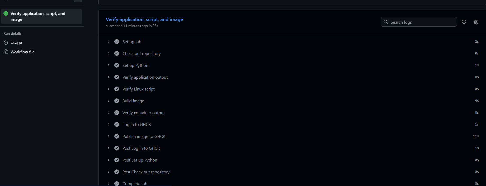
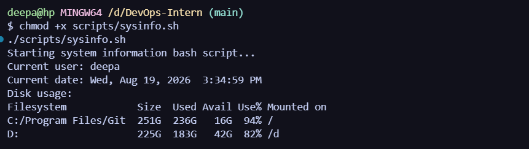
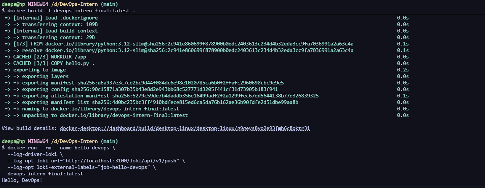
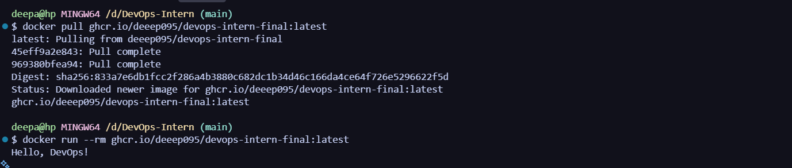
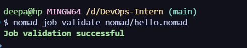
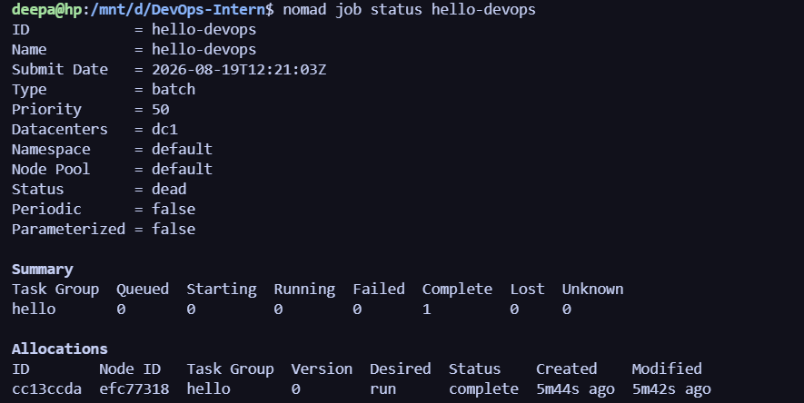
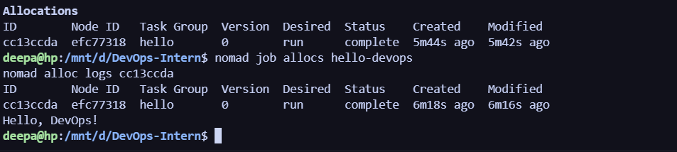
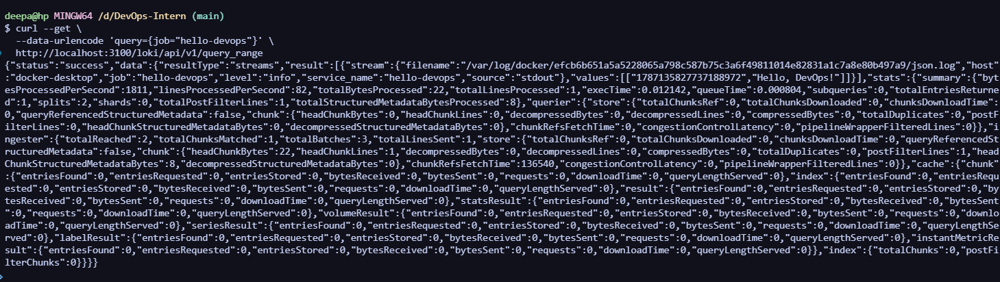

# Verification record

This document records checks that can be reproduced locally or in GitHub
Actions. It deliberately does not claim that Nomad or Loki was verified until
their commands are run and their output is appended below.

## Automated in GitHub Actions

The CI workflow performs these checks on every pull request and every push:

1. `python hello.py` prints exactly `Hello, DevOps!`.
2. `bash -n scripts/sysinfo.sh` validates shell syntax.
3. `./scripts/sysinfo.sh` executes with strict mode enabled.
4. Docker builds the image and `docker run --rm` prints exactly `Hello, DevOps!`.
5. A push to `main` publishes the verified image to GHCR.

## Local verification commands

```bash
./scripts/sysinfo.sh
docker build -t devops-intern-final:latest .
docker run --rm devops-intern-final:latest
nomad job validate nomad/hello.nomad
```

Expected application and container output:

```text
Hello, DevOps!
```

## Nomad and Loki Evidence

The following section documents the successful deployment and monitoring of the application. The logs and screenshots below verify that the Nomad job was successfully submitted, executed, and that Docker successfully forwarded the container logs to Loki.

### Loki Query Output

```json
{
  "status": "success",
  "data": {
    "resultType": "streams",
    "result": [
      {
        "stream": {
          "filename": "/var/log/docker/efcb6b651a5a5228065a798c587b75c3a6f49811014e82831a1c7a8e80b497a9/json.log",
          "host": "docker-desktop",
          "job": "hello-devops",
          "level": "info",
          "service_name": "hello-devops",
          "source": "stdout"
        },
        "values": [
          [
            "1787135827737188972",
            "Hello, DevOps!"
          ]
        ]
      }
    ]
  }
}
```

### Nomad Allocation Log Output

Run inside WSL after starting `sudo nomad agent -dev`:

```bash
nomad job run nomad/hello.nomad
nomad job status hello-devops
nomad job allocs hello-devops
nomad alloc logs <allocation-id>
```

Actual output captured from allocation `cc13ccda`:

```text
Hello, DevOps!
```

## Evidence Screenshots

### 1. CI/CD Pipeline
GitHub Actions pipeline successfully checking out the code, setting up Python, and running the verification steps:


### 2. Linux & Scripting Basics
Execution of the local `sysinfo.sh` shell script:
```bash
./scripts/sysinfo.sh
```


### 3. Docker Build & Run
Building the Docker image and running the container locally:
```bash
docker build -t devops-intern-final:latest .
docker run --rm --name hello-devops \
  --log-driver=loki \
  --log-opt loki-url="http://localhost:3100/loki/api/v1/push" \
  --log-opt loki-external-labels="job=hello-devops" \
  devops-intern-final:latest
```


### 4. Docker Pull from GHCR
Pulling the verified image from the GitHub Container Registry and running it:
```bash
docker plugin ls
curl --fail http://localhost:3100/ready
```


### 5. Nomad Job Validation
Validating the syntax and structure of the `hello.nomad` job file:
```bash
nomad job validate nomad/hello.nomad
```


### 6. Nomad Job Run & Status
Running the batch job and confirming it completes successfully (Status = **complete**):
```bash
nomad job run nomad/hello.nomad
nomad job status hello-devops
```


### 7. Nomad Allocation Logs
Fetching the allocation logs to confirm the application output:
```bash
nomad job allocs hello-devops
nomad alloc logs <allocation-id>
```


### 8. Loki Monitoring & Querying
Verifying that Loki is running and querying Loki for the ingested logs:
```bash
curl --get \
  --data-urlencode 'query={job="hello-devops"}' \
  http://localhost:3100/loki/api/v1/query_range
```

